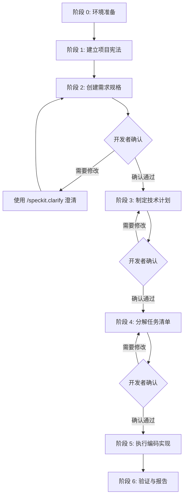

# 企业级应用软件设计与开发 - Lab 3 课后作业

## 作业标题: 基于 GitHub Spec Kit 的规格驱动开发实践

---

## 📚 作业背景

本作业旨在让学生通过实践掌握 **规格驱动开发 (Specification-Driven Development, SDD)** 的核心理念和工作流程。SDD 强调"规格先行、文档驱动"的开发模式,要求在编写代码之前,先完成详细的需求规格、技术计划和任务分解,确保开发过程有章可循、可追溯、可验证。

在本作业中,你将使用 **GitHub Spec Kit** 工具,严格按照 SDD 标准工作流完成一个完整的 Web 应用开发项目。

### 什么是 GitHub Spec Kit?

GitHub Spec Kit 是一个开源的规格驱动开发工具包,它将 AI 编码助手与结构化的规格文档相结合,实现从需求到代码的自动化转换。Spec Kit 的核心理念是:

- **规格即真理来源 (Specification as Source of Truth)**: 所有开发活动都基于规格文档
- **AI 辅助生成 (AI-Assisted Generation)**: 使用 AI 从规格自动生成计划、任务和代码
- **人工审查确认 (Human Review \u0026 Approval)**: 开发者在每个关键节点审查和确认 AI 生成的内容

> [!IMPORTANT]
> **本作业的核心要求**: 全程使用 GitHub Spec Kit 的标准命令和工作流,**所有 spec 文档必须经过开发者确认后,才能进入下一阶段**。

---

## 🎯 学习目标

通过完成本作业,你将能够:

1. **理解并实践规格驱动开发理念**
   - 掌握"先写规格,后写代码"的开发流程
   - 理解需求规格、技术计划、任务分解之间的关系
   - 体验 AI 辅助开发的完整工作流

2. **熟练使用 GitHub Spec Kit 工具**
   - 使用 Spec Kit CLI 命令管理开发流程
   - 使用 Spec Kit 模板创建标准化的规格文档
   - 配置和使用 AI 编码助手(Trae CN)

3. **建立开发者审查习惯**
   - 学会审查 AI 生成的规格和代码
   - 识别规格中的模糊点和潜在问题
   - 对 AI 生成的内容进行批判性思考

4. **完成完整的软件开发生命周期**
   - 项目宪法 → 需求规格 → 技术设计 → 任务分解 → 编码实现 → 测试验证

---

## 📋 作业要求

### 一、项目选题 (二选一)

#### 选项 A: 番茄钟计时器 (推荐)

创建一个现代化的番茄钟 Web 应用,核心功能包括:
- 25 分钟专注倒计时
- 5 分钟休息倒计时
- 自定义时间设置
- 深色模式支持
- 音频提醒功能

**推荐理由**: 功能明确、复杂度适中、易于验证

#### 选项 B: 自选项目

你可以选择自己感兴趣的 Web 应用项目,但必须满足以下条件:
- 具有至少 **3-4 个独立的用户故事** (User Stories)
- 每个用户故事可独立测试和验证
- 技术栈必须包括: 前端框架 (React/Vue/Angular) + 现代构建工具 (Vite/Webpack)
- 项目复杂度适中 (预计开发时间 15-20 小时)

---

### 二、开发流程与交付物

本作业严格遵循 **GitHub Spec Kit** 的标准工作流,分为以下阶段:



---

#### 阶段 0: 环境准备与项目初始化 (5%)

**任务**: 安装工具、配置环境、初始化项目

**必须完成的步骤**:

1. **安装 GitHub Spec Kit CLI**

```bash
# 使用 npm 安装 (推荐)
npm install -g @github/specify-cli

# 或使用 yarn
yarn global add @github/specify-cli

# 验证安装
specify --version
```

2. **配置 AI 编码助手**

选择以下任一 AI 助手并完成配置:

- **GitHub Copilot**: 在 VS Code 中安装 GitHub Copilot 插件
- **Claude Code**: 安装 Claude CLI 并配置 API Key
- **Trae CN**: 安装 Trae CN

3. **初始化项目仓库**

```bash
# 创建项目目录
mkdir my-pomodoro-timer
cd my-pomodoro-timer

# 初始化 Git 仓库
git init

# 初始化 Spec Kit
specify init
```

**交付物**:

- [ ] Spec Kit CLI 安装截图
- [ ] AI 助手配置截图
- [ ] 项目仓库初始化截图
- [ ] `setup-report.md` 文件,记录环境准备过程

**评分标准**:
- 工具安装正确 (2%)
- AI 助手配置成功 (2%)
- 项目初始化规范 (1%)

---

#### 阶段 1: 建立项目宪法 (15%)

**任务**: 使用 `/speckit.constitution` 命令定义项目的核心原则和约束

**什么是项目宪法?**

项目宪法 (Constitution) 是项目的"最高法则",定义了:
- **核心原则**: 项目的价值观和设计理念
- **技术约束**: 必须遵守的技术限制
- **开发规范**: 代码风格、命名规范、测试要求等

**执行步骤**:

1. **运行 Spec Kit 命令**

```bash
specify constitution
```

AI 会引导你回答一系列问题,例如:
- 项目的核心价值是什么?
- 有哪些技术约束? (如必须使用 TypeScript、必须支持移动端等)
- 有哪些性能要求? (如页面加载时间、响应时间等)
- 有哪些可访问性要求?

2. **审查生成的宪法文档**

Spec Kit 会生成 `specs/constitution.md` 文件,你需要仔细审查:

```markdown
# 项目宪法示例

## 核心原则

1. **用户体验优先**: 界面必须简洁、直观、响应迅速
2. **数据隐私**: 所有用户数据仅存储在本地,不上传到服务器
3. **可访问性**: 必须符合 WCAG 2.1 AA 标准

## 技术约束

- 必须使用 TypeScript (版本 5.0+)
- 必须使用 React 18+ 或 Vue 3+
- 必须支持现代浏览器 (Chrome, Firefox, Safari, Edge)
- 禁止使用外部 API (除 CDN 外)

## 性能要求

- 首屏加载时间 < 2 秒
- 计时器精度误差 < ±100ms
- UI 更新帧率 ≥ 60fps
```

**交付物**:

- [ ] `specs/constitution.md` - 项目宪法文档

**评分标准**:
- 宪法内容完整、合理 (10%)
- 对 AI 生成内容的审查和修改 (5%)

---

#### 阶段 2: 创建需求规格 (20%)

**任务**: 使用 `/speckit.specify` 和 `/speckit.clarify` 命令创建详细的需求规格

**执行步骤**:

1. **运行 Spec Kit 命令**

```bash
specify create pomodoro-timer
```

AI 会询问你项目的需求,你需要描述:
- 用户是谁?
- 用户想要做什么?
- 为什么用户需要这个功能?

**示例输入**:

```
我想创建一个番茄钟计时器应用。

用户是需要保持专注的知识工作者(如程序员、作家、学生)。

核心功能:
1. 用户可以启动 25 分钟的专注倒计时
2. 倒计时结束后播放提醒音
3. 用户可以启动 5 分钟的休息倒计时
4. 用户可以自定义专注和休息的时长
5. 支持深色模式
```

2. **审查生成的规格文档**

Spec Kit 会生成 `specs/pomodoro-timer/specification.md`,包含:

- **User Scenarios \u0026 Testing** (用户场景与测试)
- **Requirements** (功能需求)
- **Success Criteria** (成功标准)
- **Edge Cases** (边界情况)

**必须包含的内容**:

##### User Scenarios \u0026 Testing

至少 3-4 个用户故事,每个用户故事必须包括:

```markdown
### User Story 1 - 专注工作与提醒 (Priority: P1)

**作为** 一名需要保持专心的用户  
**我希望** 能够启动一个 25 分钟的倒计时  
**以便** 在专注工作后得到提醒休息

**Why this priority**: 这是番茄钟的核心价值,没有这个功能应用就失去了意义。

**Independent Test**: 
1. 用户打开应用
2. 点击"开始专注"按钮
3. 计时器从 25:00 开始倒计时
4. 25 分钟后播放提醒音

**Acceptance Scenarios**:

1. **Given** 用户打开应用  
   **When** 点击"开始专注"按钮  
   **Then** 计时器显示 25:00 并开始倒计时

2. **Given** 计时器正在运行  
   **When** 倒计时到达 00:00  
   **Then** 播放提醒音并显示"休息时间"提示

3. **Given** 计时器正在运行  
   **When** 用户点击"暂停"按钮  
   **Then** 倒计时暂停,按钮变为"继续"
```

##### Requirements

使用编号的功能需求列表:

```markdown
## Functional Requirements

- **FR-001**: 应用必须提供 25 分钟的专注倒计时功能
- **FR-002**: 应用必须提供 5 分钟的休息倒计时功能
- **FR-003**: 倒计时结束后必须播放音频提醒
- **FR-004**: 用户必须能够暂停和继续倒计时
- **FR-005**: 用户必须能够自定义专注和休息的时长
- **FR-006**: 应用必须支持深色模式切换
```

##### Success Criteria

可量化的成功标准:

```markdown
## Success Criteria

- **SC-001**: 计时器精度误差 < ±100ms
- **SC-002**: UI 更新帧率 ≥ 60fps
- **SC-003**: 所有核心功能的单元测试覆盖率 ≥ 70%
- **SC-004**: 支持 Chrome, Firefox, Safari, Edge 最新版本
- **SC-005**: 通过 WCAG 2.1 AA 可访问性标准
```

3. **使用 Clarify 命令澄清模糊点**

```bash
specify clarify pomodoro-timer
```

AI 会识别规格中的模糊或不完整的部分,例如:
- "提醒音"是什么样的音频?
- "自定义时长"的范围是多少?
- "深色模式"是自动切换还是手动切换?

**交付物**:

- [ ] `specs/pomodoro-timer/specification.md` - 需求规格文档

**评分标准**:
- 用户故事清晰、可独立测试 (8%)
- 验收场景使用 Given-When-Then 格式 (4%)
- 功能需求完整、明确 (4%)
- 成功标准可量化、可验证 (4%)

---

#### 阶段 3: 制定技术计划 (20%)

**任务**: 使用 `/speckit.plan` 命令生成技术实施计划

**执行步骤**:

1. **运行 Spec Kit 命令**

```bash
specify plan pomodoro-timer
```

AI 会根据需求规格和项目宪法,生成技术架构和实施计划。

你需要提供:
- 技术栈选择 (如 React + TypeScript + Vite)
- 存储方案 (如 LocalStorage)
- 测试框架 (如 Vitest)

2. **审查生成的计划文档**

Spec Kit 会生成 `specs/pomodoro-timer/plan.md`,包含:

**必须包含的内容**:

##### Technical Context

```markdown
## Technical Context

**Language/Version**: TypeScript 5.0+ (React 18)  
**Primary Dependencies**: 
- Vite 5.0+ (构建工具)
- Tailwind CSS 3.0+ (样式)
- Lucide React (图标)
- Howler.js (音频播放)

**Storage**: LocalStorage (用户设置和主题偏好)  
**Testing**: Vitest (单元测试) + React Testing Library  
**Performance Goals**: 
- 首屏加载 < 2s
- 计时器精度 ±100ms
- UI 更新 60fps

**Technical Constraints**:
- 必须使用 TypeScript
- 必须支持移动端响应式
- 必须符合 WCAG 2.1 AA 标准
```

##### Project Structure

```markdown
## Project Structure

### 文档结构
```
specs/
├── constitution.md
└── pomodoro-timer/
    ├── specification.md
    ├── plan.md
    ├── tasks.md
    └── verification.md
```

### 源代码结构
```
src/
├── components/          # React 组件
│   ├── TimerDisplay.tsx
│   ├── ControlButtons.tsx
│   ├── SettingsPanel.tsx
│   └── ThemeToggle.tsx
├── hooks/               # 自定义 Hooks
│   ├── useTimer.ts
│   ├── useAudio.ts
│   └── useLocalStorage.ts
├── utils/               # 工具函数
│   └── formatTime.ts
├── types/               # TypeScript 类型定义
│   └── timer.ts
├── App.tsx
└── main.tsx
```
```

##### Constitution Check

```markdown
## Constitution Check

- [x] **技术栈符合约束**: 使用 TypeScript 5.0+, React 18
- [x] **响应式设计**: 使用 Tailwind CSS 实现移动端适配
- [x] **可访问性**: 使用语义化 HTML 和 ARIA 属性
- [x] **性能目标**: 使用 `Date.now()` 确保计时精度
- [x] **遵循 SDD 流程**: 严格按照 Spec Kit 工作流
```

**交付物**:

- [ ] `specs/pomodoro-timer/plan.md` - 技术计划文档

**评分标准**:
- 技术选型合理、有依据 (8%)
- 项目结构清晰、易于维护 (7%)
- 通过宪法检查 (5%)

---

#### 阶段 4: 分解任务清单 (10%)

**任务**: 使用 `/speckit.tasks` 命令生成可执行的任务列表

**执行步骤**:

1. **运行 Spec Kit 命令**

```bash
specify tasks pomodoro-timer
```

AI 会根据技术计划,将项目分解为具体的开发任务。

2. **审查生成的任务文档**

Spec Kit 会生成 `specs/pomodoro-timer/tasks.md`,包含:

**必须包含的内容**:

```markdown
# 任务清单

## Phase 1: Setup \u0026 Foundation

- [ ] T001 [P] Initialize Vite + React + TypeScript project
- [ ] T002 [P] Install dependencies (Tailwind, Lucide, Howler)
- [ ] T003 [P] Configure Tailwind CSS
- [ ] T004 Create project structure (components/, hooks/, utils/)
- [ ] T005 Define TypeScript types in `types/timer.ts`

## Phase 2: Core Timer Logic (User Story 1)

- [ ] T010 [P] [US1] Create `useTimer` hook using `Date.now()` delta logic
- [ ] T011 [US1] Implement unit tests for `useTimer`
- [ ] T012 [P] [US1] Create `TimerDisplay` component to show MM:SS
- [ ] T013 [P] [US1] Create `ControlButtons` component (Start/Pause/Reset)
- [ ] T014 [US1] Integrate timer logic with UI components

## Phase 3: Audio Notification (User Story 1)

- [ ] T020 [P] [US1] Create `useAudio` hook with Howler.js
- [ ] T021 [US1] Add notification sound file to project
- [ ] T022 [US1] Trigger audio when timer reaches 00:00

## Phase 4: Settings Panel (User Story 2)

- [ ] T030 [US2] Create `SettingsPanel` component
- [ ] T031 [US2] Implement custom duration inputs
- [ ] T032 [US2] Create `useLocalStorage` hook
- [ ] T033 [US2] Persist settings to LocalStorage

## Phase 5: Dark Mode (User Story 3)

- [ ] T040 [US3] Create `ThemeToggle` component
- [ ] T041 [US3] Implement dark mode with Tailwind CSS
- [ ] T042 [US3] Persist theme preference to LocalStorage

## Phase 6: Testing \u0026 Verification

- [ ] T050 Run all unit tests
- [ ] T051 Test on Chrome, Firefox, Safari, Edge
- [ ] T052 Verify accessibility with Lighthouse
- [ ] T053 Measure performance metrics
```

**任务编号规范**:
- `T001-T009`: Setup 和基础设施
- `T010-T019`: 用户故事 1
- `T020-T029`: 用户故事 1 的子功能
- `[P]`: 高优先级任务
- `[US1]`, `[US2]`: 所属用户故事

**交付物**:

- [ ] `specs/pomodoro-timer/tasks.md` - 任务清单文档

**评分标准**:
- 任务分解合理、粒度适中 (5%)
- 按用户故事分组 (3%)
- 依赖关系清晰 (2%)

---

#### 阶段 5: 执行编码实现 (20%)

**任务**: 使用 `/speckit.implement` 命令执行编码,或手动按照任务清单编码

**执行步骤**:

1. **使用 Spec Kit 自动实现 (推荐)**

```bash
specify implement pomodoro-timer
```

AI 会按照任务清单逐步生成代码。你需要:
- 审查每个生成的文件
- 运行测试确保代码正确
- 提交代码到 Git

2. **或手动编码**

如果你选择手动编码,必须:
- 严格按照 `tasks.md` 的顺序执行
- 完成一个任务后,将 `[ ]` 改为 `[x]`
- 每完成一个任务(或一组相关任务)提交一次 Git

**代码质量要求**:

- 使用 TypeScript,所有函数和组件都有类型注解
- 遵循现代 Web 开发最佳实践
- 代码注释清晰(使用中文)
- 变量命名语义化

**Git 提交规范**:

```bash
git commit -m "[T001] 初始化 Vite + React + TypeScript 项目"
git commit -m "[T010] 实现 useTimer hook"
git commit -m "[T012-T013] 创建 TimerDisplay 和 ControlButtons 组件"
```

**单元测试要求**:

核心逻辑必须有单元测试覆盖,测试覆盖率建议 > 70%

**示例测试**:

```typescript
// tests/useTimer.test.ts
import { renderHook, act } from '@testing-library/react';
import { useTimer } from '../hooks/useTimer';

describe('useTimer', () => {
  it('should start at 25:00 for focus mode', () => {
    const { result } = renderHook(() => useTimer('focus'));
    expect(result.current.timeLeft).toBe(25 * 60);
  });

  it('should decrement time when started', async () => {
    jest.useFakeTimers();
    const { result } = renderHook(() => useTimer('focus'));
    
    act(() => {
      result.current.start();
    });

    act(() => {
      jest.advanceTimersByTime(1000);
    });

    expect(result.current.timeLeft).toBe(25 * 60 - 1);
    jest.useRealTimers();
  });
});
```

**交付物**:

- [ ] 完整的源代码(在 `src/` 目录)
- [ ] 单元测试(在 `tests/` 目录)
- [ ] 规范的 Git 提交历史
- [ ] 更新后的 `tasks.md`(所有任务标记为 `[x]`)

**评分标准**:
- 代码按照 tasks.md 实现 (5%)
- 代码质量和可维护性 (8%)
- Git 提交规范 (4%)
- 单元测试覆盖 (3%)

---

#### 阶段 6: 验证与报告 (10%)

**任务**: 验证所有成功标准,编写验证报告和最终总结

**执行步骤**:

1. **创建验证报告**

创建 `specs/pomodoro-timer/verification.md`,逐一验证:

- 所有用户故事的验收场景
- 所有功能需求
- 所有成功标准
- 所有边界情况

**示例验证报告**:

```markdown
# 验证报告

## User Story 验证

### ✅ User Story 1 - 专注工作与提醒 (P1)

**场景 1**: 启动专注计时

- **验证结果**: ✅ **通过**
  - 初始显示 25:00
  - 点击绿色播放按钮后开始倒计时
  - 按钮变为黄色暂停按钮
  - **截图**: 

**场景 2**: 倒计时结束提醒

- **验证结果**: ✅ **通过**
  - 倒计时到达 00:00 时播放提醒音
  - 显示"休息时间"提示
  - **测试日志**:
    ```
    [Timer] Started at 25:00
    [Timer] Reached 00:00 at 2026-02-05 15:30:00
    [Audio] Playing notification.mp3
    ```

## Functional Requirements 验证

| 需求编号 | 描述 | 验证方式 | 结果 |
|---------|------|---------|------|
| FR-001 | 25 分钟专注倒计时 | UI 测试 | ✅ 通过 |
| FR-002 | 5 分钟休息倒计时 | UI 测试 | ✅ 通过 |
| FR-003 | 音频提醒 | 手动测试 | ✅ 通过 |
| FR-004 | 暂停/继续功能 | UI 测试 | ✅ 通过 |
| FR-005 | 自定义时长 | UI 测试 | ✅ 通过 |
| FR-006 | 深色模式 | UI 测试 | ✅ 通过 |

## Success Criteria 验证

| 标准编号 | 描述 | 目标值 | 实际值 | 结果 |
|---------|------|--------|--------|------|
| SC-001 | 计时器精度 | < ±100ms | ±50ms | ✅ 通过 |
| SC-002 | UI 更新帧率 | ≥ 60fps | 60fps | ✅ 通过 |
| SC-003 | 测试覆盖率 | ≥ 70% | 75% | ✅ 通过 |
| SC-004 | 浏览器兼容性 | Chrome, Firefox, Safari, Edge | 全部通过 | ✅ 通过 |
| SC-005 | 可访问性 | WCAG 2.1 AA | Lighthouse 得分 95 | ✅ 通过 |

## Edge Cases 验证

- ✅ 用户在倒计时中途刷新页面 → 计时器重置(符合预期)
- ✅ 用户设置时长为 0 → 显示错误提示(符合预期)
- ✅ 用户设置时长超过 180 分钟 → 显示警告(符合预期)
```

2. **创建最终报告**

创建 `specs/pomodoro-timer/final-report.md`:

```markdown
# 最终报告

## 完成情况总览

| 阶段 | 状态 | 完成时间 |
|------|------|---------|
| 阶段 0: 环境准备 | ✅ 完成 | 2026-02-05 |
| 阶段 1: 项目宪法 | ✅ 完成 | 2026-02-05 |
| 阶段 2: 需求规格 | ✅ 完成 | 2026-02-06 |
| 阶段 3: 技术计划 | ✅ 完成 | 2026-02-06 |
| 阶段 4: 任务分解 | ✅ 完成 | 2026-02-07 |
| 阶段 5: 编码实现 | ✅ 完成 | 2026-02-10 |
| 阶段 6: 验证报告 | ✅ 完成 | 2026-02-11 |

**任务完成统计**:
- 总任务数: 25
- 已完成: 25
- 完成率: 100%

## 技术亮点

### 1. 高精度计时器实现

使用 `Date.now()` 的增量逻辑而非 `setInterval`,确保计时精度:

```typescript
const useTimer = (duration: number) => {
  const [timeLeft, setTimeLeft] = useState(duration);
  const startTimeRef = useRef<number | null>(null);

  useEffect(() => {
    if (!isRunning) return;

    startTimeRef.current = Date.now();
    const interval = setInterval(() => {
      const elapsed = Math.floor((Date.now() - startTimeRef.current!) / 1000);
      setTimeLeft(duration - elapsed);
    }, 100); // 每 100ms 更新一次,确保 UI 流畅

    return () => clearInterval(interval);
  }, [isRunning, duration]);

  return { timeLeft, start, pause, reset };
};
```

### 2. 深色模式实现

使用 Tailwind CSS 的 `dark:` 前缀和 LocalStorage 持久化:

```typescript
const useTheme = () => {
  const [theme, setTheme] = useLocalStorage<'light' | 'dark'>('theme', 'light');

  useEffect(() => {
    if (theme === 'dark') {
      document.documentElement.classList.add('dark');
    } else {
      document.documentElement.classList.remove('dark');
    }
  }, [theme]);

  return { theme, toggleTheme: () => setTheme(theme === 'light' ? 'dark' : 'light') };
};
```

### 3. 可访问性优化

- 使用语义化 HTML (`<button>`, `<time>`, `<label>`)
- 添加 ARIA 属性 (`aria-label`, `aria-live`)
- 支持键盘导航 (`Tab`, `Enter`, `Space`)

## 学到的经验

### 1. 规格驱动开发的价值

在开始编码前完成详细的规格文档,让我在实现过程中:
- 减少了返工和重构
- 明确了每个功能的验收标准
- 更容易进行任务分解和时间估算

### 2. AI 辅助开发的正确姿势

使用 GitHub Spec Kit 后,我发现:
- AI 生成的代码需要仔细审查,不能盲目信任
- 规格越详细,AI 生成的代码质量越高
- 人工确认环节是保证质量的关键

### 3. 遇到的问题和解决方案

**问题 1**: `setInterval` 导致计时器不准确

**解决方案**: 改用 `Date.now()` 的增量逻辑,每次计算实际经过的时间

**问题 2**: 深色模式切换时闪烁

**解决方案**: 在 HTML 中添加内联脚本,在页面加载前应用主题

## 项目统计

- **代码行数**: 1,200 行 (不含测试)
- **组件数量**: 6 个
- **自定义 Hooks**: 3 个
- **测试用例数量**: 15 个
- **测试覆盖率**: 75%
- **Git 提交数**: 25 次

## 总结

通过这个项目,我深刻体会到了规格驱动开发的价值。在开始编码前花时间编写详细的规格文档,虽然看起来增加了前期工作量,但实际上大大提高了开发效率和代码质量。

GitHub Spec Kit 工具让这个过程更加系统化和自动化,AI 辅助生成规格和代码,人工审查确保质量,这种"人机协作"的模式是未来软件开发的趋势。
```

**交付物**:

- [ ] `specs/pomodoro-timer/verification.md` - 验证报告
- [ ] `specs/pomodoro-timer/final-report.md` - 最终报告
- [ ] 验证截图(在 `specs/pomodoro-timer/screenshots/` 目录)

**评分标准**:
- 验证完整、系统 (5%)
- 提供验证证据(截图、日志等) (3%)
- 最终报告全面、深入 (2%)

---

## 📦 提交要求

### 1. GitHub 仓库结构

你的最终提交应包含以下目录结构:

```
your-project/
├── specs/
│   ├── constitution.md                    # 项目宪法
│   └── pomodoro-timer/                    # 功能规格目录
│       ├── specification.md               # 需求规格
│       ├── plan.md                        # 技术计划
│       ├── tasks.md                       # 任务清单
│       ├── verification.md                # 验证报告
│       ├── final-report.md                # 最终报告
│       └── screenshots/                   # 验证截图
├── src/                                   # 源代码目录
│   ├── components/
│   ├── hooks/
│   ├── utils/
│   ├── types/
│   ├── App.tsx
│   └── main.tsx
├── tests/                                 # 测试目录
├── public/                                # 静态资源
├── setup-report.md                        # 环境准备报告
├── README.md                              # 项目说明
├── package.json                           # 依赖配置
└── vite.config.ts                         # 构建配置
```

### 2. 提交方式

1. 将项目推送到你的 GitHub 仓库
2. 在课程平台提交仓库链接
3. 确保仓库是 **公开的 (Public)** 或已邀请老师为协作者

### 3. 提交截止日期

**截止日期**: [由任课教师填写]

---

## 🎓 评分标准总结

| 阶段 | 内容 | 分值 |
|------|------|------|
| 阶段 0 | 环境准备与项目初始化 | 5% |
| 阶段 1 | 项目宪法编写与确认 | 15% |
| 阶段 2 | 需求规格编写与确认 | 20% |
| 阶段 3 | 技术计划编写与确认 | 20% |
| 阶段 4 | 任务分解与确认 | 10% |
| 阶段 5 | 编码实现 | 20% |
| 阶段 6 | 验证与报告 | 10% |
| **总计** | | **100%** |

### 开发者审查评分细则

各阶段中对 AI 生成内容的审查和修改占该阶段分数的一部分:

- ✅ **审查质量**: 是否仔细审查了 AI 生成的内容
- ⚠️ **问题识别**: 是否识别出 AI 生成内容中的问题
- 🔄 **修改完善**: 是否对不合理的内容进行了修改和完善

### 加分项 (最多 +10%)

- **创新性**: 在项目中使用了创新的技术或设计 (+5%)
- **完整性**: 超出基本要求,实现了额外的功能 (+3%)
- **文档质量**: 文档撰写特别清晰、专业 (+2%)

---

## 💡 学习资源

### GitHub Spec Kit 官方资源

1. **官方仓库**: [github.com/github/spec-kit](https://github.com/github/spec-kit)
2. **官方文档**: [Spec Kit Documentation](https://github.com/github/spec-kit/blob/main/README.md)
3. **视频教程**: [Spec-Driven Development with GitHub Spec Kit](https://www.youtube.com/watch?v=...)

### 规格驱动开发理念

1. **Specification by Example** - Gojko Adzic
2. **Behavior-Driven Development** - [Cucumber 文档](https://cucumber.io/docs/bdd/)
3. **Given-When-Then 格式指南** - [Martin Fowler](https://martinfowler.com/bliki/GivenWhenThen.html)

### 现代 Web 开发

1. [React 官方文档](https://react.dev/)
2. [TypeScript 官方文档](https://www.typescriptlang.org/docs/)
3. [Vite 官方文档](https://vitejs.dev/)
4. [Tailwind CSS 官方文档](https://tailwindcss.com/docs)

---

## ❓ 常见问题

### Q1: 我必须使用 GitHub Spec Kit 的 CLI 工具吗?

**A**: 是的,这是本实验的核心要求。Spec Kit CLI 是规格驱动开发的标准工具,能够自动化许多流程,并确保文档的一致性和完整性。

### Q2: 如果 AI 生成的规格不符合我的需求怎么办?

**A**: 你需要:
1. 仔细审查 AI 生成的内容
2. 手动修改规格文档中不合理的部分
3. 必要时重新运行 `/speckit.clarify` 或 `/speckit.plan` 命令
4. 重复直到满意

AI 是辅助工具,最终决策权在你手中。

### Q3: 我可以跳过某个 Spec Kit 命令吗?

**A**: 不可以。实验要求严格遵循 Spec Kit 的标准工作流:

```
constitution → specify → clarify → plan → tasks → implement
```

如果你认为某个命令不适用,需要在文档中说明理由,并获得老师批准。

### Q4: 我可以使用 AI 工具 (如 GitHub Copilot、ChatGPT) 吗?

**A**: 可以,但必须遵循以下原则:
- AI 工具只能用于辅助编码,不能替代你的思考
- 所有的规格文档必须经过你的审查和确认
- 你必须理解每一行 AI 生成的代码,并能够解释其原理
- 在最终报告中说明你使用了哪些 AI 工具,以及如何使用

### Q5: 如果我的项目没有按照 tasks.md 的顺序实现怎么办?

**A**: 这是不符合 SDD 理念的。如果你发现任务顺序不合理,应该:
1. 先修改 `tasks.md`,调整任务顺序
2. 在 Git 提交中说明为什么调整
3. 在最终报告中反思为什么最初的任务分解不合理

### Q6: 我的项目可以使用其他技术栈 (如 Vue、Angular) 吗?

**A**: 可以,但必须在 `plan.md` 中详细说明技术选型的理由,并通过"宪法检查"。

### Q7: 验证报告中的截图必须是真实运行的吗?

**A**: 是的。所有验证证据必须是真实的,不能伪造。老师会随机抽查项目的运行情况。

### Q8: 我可以和同学合作完成这个作业吗?

**A**: 本作业为个人作业,不允许合作。但你可以和同学讨论技术问题,只要不直接复制代码或文档。

### Q9: 如果我在某个阶段卡住了怎么办?

**A**: 你可以:
1. 查阅 GitHub Spec Kit 官方文档
2. 在课程平台提问
3. 参加答疑时间
4. 查看本仓库的参考项目 (如果提供)

---

## 📞 联系方式

如有任何问题,请通过以下方式联系:

- **课程平台**: [由任课教师填写]
- **邮箱**: [由任课教师填写]
- **答疑时间**: [由任课教师填写]

---

## 🎯 总结

本作业的核心目标是让你体验 **GitHub Spec Kit 驱动的规格驱动开发** 完整流程:

1. **规格先行,文档驱动** - 确保需求清晰、可验证
2. **AI 辅助生成,人工审查确认** - 提高效率,保证质量
3. **全程可追溯** - 从需求到代码到测试,全程有据可查
4. **系统化流程** - 通过标准化的工作流保证代码质量

通过完成这个作业,你将建立起一套可以应用于实际工作的软件开发方法论,并掌握 AI 时代的新型开发模式。

**祝你开发顺利!** 🚀

---


---

*本作业指导书基于 GitHub Spec Kit 官方文档和规格驱动开发最佳实践编写*  
*最后更新时间: 2026-02-05*
